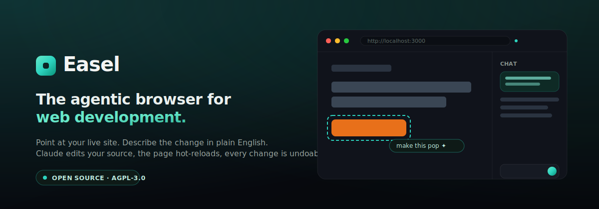

<p align="center">
  
</p>

<p align="center">
  <strong>Point at your running local site. Draw on it. Tell the AI what to change. Watch your source update — live.</strong>
</p>

<p align="center">
  <a href="LICENSE"></a>
  
  
  
</p>

<p align="center">
  
</p>

---

Easel is a desktop **browser for web developers**. It loads your running dev
server, lets you **select an element** or **scribble on the page**, and you just
say what you want in plain English. The AI reads the rendered element's source,
edits your files, and your dev server hot-reloads the result. Every change
is a git checkpoint, so undo is one click.

```
Click a heading      → "make this white, it's too grey"
Circle a hero image  → "replace this with a golden doodle"
Draw an arrow + box  → "move this to the top-left, under the photo"
```

No context-switching between editor, browser, and DevTools. If you can point at
it, you can change it.

> **Use your Claude subscription, not pay-as-you-go API credits.** Easel's default
> backend rides on the Claude credentials already on your machine (the same login
> the Claude Code CLI uses) — so for Pro/Max subscribers, editing costs **no extra
> spend**. API keys, Bedrock, Vertex, and local models are all supported too.

---

## Table of contents

- [Why Easel](#why-easel)
- [How it works](#how-it-works)
- [Quick start](#quick-start)
- [Connecting Claude](#connecting-claude)
- [Features](#features)
- [Screenshots](#screenshots)
- [Architecture](#architecture)
- [Development](#development)
- [Contributing](#contributing)
- [License](#license)
- [FAQ](#faq)

---

## Why Easel

Modern front-end work splits your attention across an editor, a browser, DevTools,
and a file tree. You tweak CSS, flip to the browser, see it's wrong, flip back.
Easel collapses that loop into one window:

- **⚡ 10× faster visual iteration** — point and describe instead of hunting for the
  right file and the right class name.
- **🎨 Visual authoring for developers** — element-select for precision, freeform
  markup (rectangle, ellipse, arrow, freehand, pin) for "this area, roughly here."
- **↩️ Always undoable** — every accepted edit is a git checkpoint; roll back with a click.
- **🧩 Works with your stack** — point it at any dev server on `localhost` (Vite,
  Next.js, Remix, SvelteKit, Astro, plain HTML). Auto-start + framework detection
  cover Vite, Next, Vue, and Svelte today; anything else works by typing its URL.
- **🔌 Bring your own model** — Claude via your subscription (default), Anthropic API,
  AWS Bedrock, Google Vertex, or a **local model** (Ollama / LM Studio).
- **🔓 Open source (AGPL-3.0)** — self-host it, fork it, audit it. No telemetry.

---

## How it works

### Two ways to point

**Select mode** — click a rendered element. Easel maps it back to the exact source
file and line (precisely, when the [Vite plugin](#optional-precise-source-mapping)
is installed; via a smart grep/selector fallback otherwise), then you describe the change.

**Markup mode** — draw rectangles, ellipses, arrows, freehand strokes, or pins on
the page like a whiteboard. Drag to move them, grab a corner to resize, hover for
an **×** to remove. Then describe the change for everything you marked.

### The edit loop

```
Your instruction ("make this white")
        │
        ▼
Renderer builds an EditRequest  (text + element targets + a screenshot of your marks)
        │  typed IPC
        ▼
Main process → selected agent backend (Claude Agent SDK · Anthropic API · local)
        │
        ▼
Agent reads the source, makes the minimal edit, streams its progress to the chat
        │
        ▼
Your dev server's HMR detects the changed files and hot-reloads the preview
        │
        ▼
A git checkpoint is recorded  →  undo / redo anytime
```

---

## Quick start

### Download a prebuilt app

Grab the latest installer from the [**Releases**](https://github.com/bkizer1/Easel/releases/latest) page:

| Platform | File |
| --- | --- |
| **macOS** (Apple Silicon) | `.dmg` |
| **Windows** | `.exe` installer (or portable `.zip`) |
| **Linux** | `.AppImage` or `.deb` |

> **First launch (unsigned builds).** Easel isn't code-signed yet, so your OS warns
> the first time. **macOS:** right-click the app → **Open** → **Open**; if it's still
> blocked, run `xattr -dr com.apple.quarantine /Applications/Easel.app`.
> **Windows:** **More info → Run anyway** on the SmartScreen prompt.
>
> Updates are **manual** for now — there's no in-app auto-updater yet, so grab new
> versions from the Releases page.

### …or run from source

**Prerequisites:** Node.js 20+, Git (for undo/redo checkpoints), and
[Claude access](#connecting-claude) — a Pro/Max subscription (recommended) or an API key.

```bash
git clone https://github.com/bkizer1/Easel.git
cd Easel
npm install
npm run dev      # launches the Easel desktop app
```

### Then — point it at your project

The window that opens **is** the browser; there's no separate Chrome.

1. Click the **📁 folder icon** and choose your project's directory. Easel detects the
   framework and dev port, **starts your dev server for you**, and loads it in the
   preview. *(Already running your own dev server? Easel just uses it.)*
2. Toggle **Select** or **Markup** in the toolbar, mark something, and describe the
   change in the chat. Watch the AI edit your source and the page hot-reload.
3. Don't like how it landed? Open **History** (the clock icon) and revert to any
   earlier state — the preview re-renders instantly.

> You can also type any URL (e.g. `localhost:3000`) into the address bar to point at
> something Easel didn't start.

> **No project handy?** A ready-made demo lives in [`examples/demo-app`](examples/demo-app).
> Open that folder in Easel and it auto-starts the dev server and loads — full of
> things to try ("make this grey text white", "replace this image with a golden doodle").

### Build an installable app

```bash
npm run build         # typecheck + lint + bundle + package (electron-builder)
# → installers land in dist/  (.dmg / .exe / AppImage / deb)
```

Release builds ship with a CycloneDX **SBOM**, an aggregated third-party
**NOTICE**, and (in CI) **SLSA build-provenance attestations**. See
[`SECURITY.md`](SECURITY.md) and [`THIRD_PARTY_LICENSES.md`](THIRD_PARTY_LICENSES.md).

### Optional: precise source mapping

Easel works without it, but adding the (MIT-licensed) plugin to your project gives
pinpoint element→source accuracy.

> **Not on npm yet.** For now, use the copy in this repo
> ([`packages/vite-plugin-inspector`](packages/vite-plugin-inspector)) via a workspace
> or local path — or just skip it; Easel's selector/grep fallback works without it.
> (Publishing to npm is on the [roadmap](docs/ROADMAP.md).)

```typescript
// vite.config.ts
import { defineConfig } from 'vite'
import react from '@vitejs/plugin-react'
import { easelInspector } from '@easel/vite-plugin-inspector'

export default defineConfig({
  plugins: [easelInspector(), react()],   // dev-only; stamps data-easel-source on elements
})
```

---

## Connecting Claude

Open **Settings** (the model chip or ⚙ in the toolbar). The agent layer is a
provider matrix — pick what fits:

| Provider / mode | Extra cost? | How it authenticates |
| --- | --- | --- |
| **Claude Agent SDK · Inherit** *(default)* | **None beyond your Claude plan** | Uses the Claude credential already on your machine — the same login the Claude Code CLI uses. |
| Claude Agent SDK · **Setup token** | None beyond your plan | Run `claude setup-token`, paste the token into Settings. Stored encrypted in your OS keychain. |
| Claude Agent SDK · **API key** | Pay-as-you-go | An Anthropic API key (`ANTHROPIC_API_KEY`). |
| Claude Agent SDK · **Bedrock / Vertex** | Your AWS / GCP bill | `CLAUDE_CODE_USE_BEDROCK` / `CLAUDE_CODE_USE_VERTEX` + ambient cloud credentials. |
| Claude Agent SDK · **Gateway** | Depends | Route through an Anthropic-compatible proxy (`ANTHROPIC_BASE_URL`). |
| **Anthropic API** (direct) | Pay-as-you-go | A hand-built tool-loop on the Messages API; needs an API key. |
| **Local / OpenAI-compatible** | Free / local | Ollama, LM Studio, llama.cpp, vLLM. ⚠️ Smaller models vary in tool-use reliability. |

> **No "Login with Claude" button by design.** Easel never implements its own
> Claude OAuth flow or reads your credentials directly — that would violate
> Anthropic's terms for redistributed apps. It simply uses whatever Claude auth
> your machine already has. If the agent reports it isn't authenticated, Easel
> shows a banner: run `claude` → `/login` (or `claude setup-token`), or add a key.

> **The Claude Agent SDK isn't bundled.** Easel does not redistribute Anthropic's
> proprietary SDK inside its installers — it uses the copy on *your* machine. From
> source (`npm install`) it's already there; for a downloaded build, install it once
> with `npm install -g @anthropic-ai/claude-agent-sdk`. If it's missing, Easel tells
> you exactly that — and the other backends (API key, local model) still work.

Secrets you enter are encrypted at rest via Electron `safeStorage` and never touch
the renderer or the logs.

---

## Features

- **Select mode** — click an element, see its source, edit by instruction; multi-select supported.
- **Markup mode** — rectangle / ellipse / arrow / freehand / pin, in any color.
- **Editable annotations** — drag to move, corner-handles to resize, hover-× to remove.
- **Auto-started dev server** — open a project and Easel detects the framework (Vite, Next, Vue, Svelte), picks the dev port, and runs your dev command for you (or uses a server you already have).
- **Revert anything** — a visual **History** timeline of git checkpoints (including the original pre-Easel state); jump back to any point and the preview re-renders. ⌘Z / ⌘⇧Z too.
- **Page console** — warnings and errors from the previewed page surface in Easel with an error badge, so a blank screen always has an explanation.
- **Responsive viewport** — Desktop / Tablet / Mobile presets to check layouts.
- **DevTools & open-in-browser** — pop Chrome DevTools for the preview, or open the current URL in your real browser.
- **Browser chrome** — address bar, back / forward / reload, live reachability indicator.
- **Voice or text** input (Web Speech API).
- **Streaming chat + diffs** — watch the agent's messages, tool calls, and file diffs in real time.
- **Image tool** — swap images via a pluggable provider: fetch-by-URL out of the box, or generate with an OpenAI key.
- **Provider matrix** — subscription, API key, Bedrock, Vertex, gateway, or local models.
- **Polished, dark "Midnight Atelier" UI** — Bricolage Grotesque + Geist, a jade accent, built to disappear behind your work.
- **Cross-platform** — macOS, Windows, Linux.

---

## Screenshots

The demo at the top of this README shows the full loop — select an element,
describe the change, watch the source update live. To add stills, drop PNGs into
`docs/media/` (suggested names in [`docs/media/README.md`](docs/media/README.md)).

---

## Architecture

Easel is an **Electron** app with a strict process split and a pluggable agent backend.

```
┌────────────────────────────────────────────────────────────┐
│ MAIN  (Node.js — full privilege)                            │
│  app lifecycle · typed IPC · settings + safeStorage secrets │
│  git checkpoints · project detection · agent backends       │
└────────────────────────────────────────────────────────────┘
        ▲  typed IPC (src/shared/ipc.ts)   │
        │                                  ▼
┌────────────────────────────────────────────────────────────┐
│ RENDERER  (React 18 + Tailwind + Zustand — sandboxed)       │
│  toolbar · address bar · preview · annotation overlay · chat │
└────────────────────────────────────────────────────────────┘
        │  <webview> + guest preload (sendToHost)
        ▼
   Your dev server (separate process; optional @easel/vite-plugin-inspector)
```

**Design decisions**

- **Process isolation** — `contextIsolation: true`, no `nodeIntegration`; the renderer
  reaches privilege only through the typed `window.easel` bridge.
- **Pluggable agent** — every backend implements one `AgentBackend` interface
  (`src/shared/agent.ts`); the active one is chosen in Settings.
- **Git checkpoints** — accepted edits commit to a dedicated Easel ref so your own
  branch/history is untouched; reject == restore the previous checkpoint.
- **Typed IPC** — no stringly-typed channels; the contract lives in `src/shared/`.
- **Path sandbox** — the agent cannot write outside the open project root.

Deep dives: [`docs/ARCHITECTURE.md`](docs/ARCHITECTURE.md) ·
[`docs/ELEMENT_SOURCE_MAPPING.md`](docs/ELEMENT_SOURCE_MAPPING.md) ·
[`docs/REQUIREMENTS.md`](docs/REQUIREMENTS.md) · [`docs/ROADMAP.md`](docs/ROADMAP.md)

---

## Development

```bash
npm run dev          # Electron + Vite with hot-reload
npm run typecheck    # tsc, strict
npm run lint         # eslint (enforces main ↔ renderer import boundaries)
npm run build        # production build + installers
```

```
src/
├── shared/        # cross-process contracts — types.ts · agent.ts · ipc.ts · result.ts
├── main/          # Node side — window · ipc · settings · project · checkpoints · agents/
├── preload/       # window.easel bridge + webview/ guest inspector
└── renderer/      # React UI — App · store (Zustand) · components/ · lib/ · styles/
packages/
└── vite-plugin-inspector/   # @easel/vite-plugin-inspector (MIT, user-installable)
```

Standards: TypeScript strict everywhere, no `any` across process boundaries,
functional React, conventional commits.

---

## Contributing

Contributions are very welcome — see [`CONTRIBUTING.md`](CONTRIBUTING.md) and our
[`CODE_OF_CONDUCT.md`](CODE_OF_CONDUCT.md). Easel uses a lightweight
[Contributor License Agreement](CLA.md) (a DCO sign-off, `git commit -s`) so the
project can stay open source **and** be offered commercially. Please open an issue
for anything substantial before a big PR.

---

## License

Easel is **dual-licensed** — full details in [`LICENSING.md`](LICENSING.md):

- The **app** is **AGPL-3.0-or-later** ([`LICENSE`](LICENSE)). Use, modify, and
  self-host freely; if you distribute it or run a modified version as a service,
  share your source under the same terms.
- The **`@easel/vite-plugin-inspector`** package is **MIT**, so you can add it to
  any project — including proprietary ones — without copyleft obligations.
- A **commercial license** (waiving AGPL terms) and **acquisition inquiries** are
  welcome: **Blake Kizer · `blake.kizer@gmail.com`**.

© Blake Kizer. "Easel" and the project marks are the author's.

---

## FAQ

**Does using Easel cost money?**
The app is free and open source. On the default *inherit* / *setup-token* modes it
runs against your existing Claude Pro/Max subscription — **no extra pay-as-you-go
charges**. API-key, Bedrock, and Vertex modes bill to those providers; local models
are free.

**Which frameworks work?**
Anything served over a dev server — Vite, Next.js, Remix, Nuxt, SvelteKit, Astro,
plain HTML. The optional Vite plugin adds pinpoint source mapping; without it, Easel
uses a selector/grep fallback.

**Does Easel send my code anywhere?**
Only to whichever Claude provider you choose, as part of the edit. No telemetry, no
analytics, no phoning home. Keys are encrypted locally via `safeStorage`.

**What if the agent makes a bad edit?**
Every edit is a git checkpoint — undo from the toolbar, or reject before accepting.

**Can I plug in a different model?**
Yes — local/OpenAI-compatible endpoints are supported out of the box, and the
`AgentBackend` interface makes adding new providers straightforward.

---

<p align="center">
  Built with Electron, React, Vite, Tailwind, Zustand, lucide-react, Geist &amp; Bricolage Grotesque —
  and the Claude Agent SDK.
</p>
